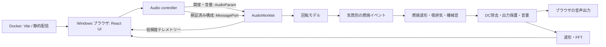

# エンジン音シミュレーター 実装計画

作成日: 2026-09-12。状態: 初回コミット後の設計・開発基盤整備。アプリ本体は未実装。

## 1. 目的と到達点

アクセル操作、気筒数、燃焼位相からエンジンの状態を計算し、ブラウザで音を連続生成する。録音済みエンジン音の切り替えやループ再生は使わない。最初は4ストロークのバイクを対象にし、音声処理の核を共通化して自動車へ拡張する。

初期方式は、回転運動・燃焼イベントとデジタル音響モデルを組み合わせる「物理に基づく手続き的合成」とする。熱力学・燃焼室・排気管内流れを完全に解くシミュレーターではない。実車同等の音を約束せず、まず位相や負荷の違いが計算と聴感の両面で説明できることを目標にする。

### MVP に含めるもの

- ユーザー操作による音声開始、停止、音量調整、ミュート。
- アクセル開度 0–100%。スライダーと、押している間だけ開く操作を用意する。
- アイドリング、回転上昇・下降、レブリミッター、慣性と簡易的な負荷。
- 4ストローク単気筒、並列2気筒（180° / 270° / 360°）、等間隔3気筒・4気筒。
- プリセット選択と、気筒ごとの燃焼位相の編集。エンジン構成変更は一度停止して適用する。
- RPM、開度、燃焼イベント列、波形・周波数スペクトルの表示。
- 録音素材に依存しない燃焼パルス、吸排気共鳴、簡易機械音。
- Chromium / Edge を初期の主対象とし、Firefox でも検証する。

### MVP の後に扱うもの

2ストローク、V型・クロスプレーンの検証済みプリセット、スターターと失火・エンストの詳細、クラッチ・ギア・車速、ターボ、排気管の分岐・反射、車内外の聴取位置、録音書き出し、モバイル Safari 対応を段階的に追加する。アカウント、DB、サーバーでの音声合成、3D 車体表示は初期スコープに含めない。

## 2. 技術選定

| 領域                  | 採用                                    | 理由・扱い                                                                     |
| --------------------- | --------------------------------------- | ------------------------------------------------------------------------------ |
| UI                    | React 19 + TypeScript                   | パラメーター編集と可視化をコンポーネント化。音声計算は React から独立させる    |
| ビルド / 開発サーバー | Vite 8                                  | クライアント中心の SPA として小さく開始。SSR・サーバー機能が必要な構成ではない |
| 音声                  | Web Audio API + AudioWorklet            | 音声レンダリングスレッドで PCM を生成。AudioParam で連続値を渡す               |
| DSP / 回転モデル      | TypeScript の独立モジュール             | 同じ実装をリアルタイム再生とオフライン数値テストで使用                         |
| 状態管理              | React state / reducer + 音声 controller | UI 設定と音声状態を分離。毎サンプルの値を React state に流さない               |
| 表示                  | CSS + Canvas 2D + AnalyserNode          | メーター、波形、FFT に必要な最小構成。チャートライブラリは当初不要             |
| 単体テスト            | Vitest 5                                | 数値計算と DSP を DOM なしで検証                                               |
| ブラウザ検証          | Playwright                              | 開始操作、Worklet 読み込み、構成変更、エラー処理を検証                         |
| コード品質            | TypeScript strict + ESLint + Prettier   | React Hooks 規則を含む検証を M1 で追加。ドキュメントは Markdownlint            |
| 実行基盤              | Node.js 24 LTS + npm + Docker Compose   | Node 26 Current より LTS を優先。npm ci と lockfile で再現性を確保             |
| 本番配信              | ビルド済み静的ファイル + Nginx コンテナ | M1 で multi-stage Dockerfile を追加。音声処理は利用者のブラウザで実行          |
| CI                    | GitHub Actions + Docker                 | ローカルと同じ Makefile で検証。PR から main へ取り込む                        |

2026-09-12 に npm registry で React 19.3.0、TypeScript 7.0.2、Vite 8.3.0、Vitest 5.0.0、Playwright 1.63.0 を確認した。これらは本体実装時の候補バージョンであり、まだインストールしていない。M1 でプラグイン・型定義・ブラウザイメージの互換性を確認し、実際の採用バージョンを lockfile へ固定する。現在の基盤は Node 24.21.0、Prettier 3.9.6、Markdownlint CLI2 0.23.2 を使用する。

React 公式の [Vite を用いた構成例](https://react.dev/learn/build-a-react-app-from-scratch)、[Vite の実行要件](https://vite.dev/guide/)、[Node.js リリース情報](https://nodejs.org/en/about/previous-releases)を踏まえた選定。Next.js はサーバー側機能が必要になった時点で再検討する。Tone.js の音楽シーケンサー抽象化は燃焼計算の中心には使わない。Rust / C++ / WASM は性能測定で必要性が確認された場合に限定する。

## 3. 実行構成と責務



- UI: 設定の編集、入力検証、ユーザーの操作と描画。レンダリング頻度は音声の時間基準にしない。
- Controller: AudioContext の生成・再開・終了、Worklet の読み込み、ノード接続、パラメーター送信。React StrictMode や再マウントでも二重に音を鳴らさない。
- Engine core: 回転、クランク位相、気筒ごとの燃焼状態。ブラウザ API・React に依存しない。
- DSP: 入力状態からサンプルを生成。乱数を使う場合は seed 指定可能にする。
- Worklet: core / DSP と Web Audio の接続。音声時間がシミュレーションの基準。

音は Docker / WSL の音声デバイスを使わない。Windows のブラウザから `http://localhost:5173` を開き、そのブラウザの出力先で再生する。Docker に PulseAudio や音声デバイスのマウントは不要。

## 4. エンジンと燃焼のモデル

### 4.1 単位と位相の定義

回転数を `r [rpm]`、サンプルレートを `fs [Hz]`、気筒数を `N` とする。4ストロークはクランク2回転で1サイクルなので `C = 720°`、将来の2ストロークは `C = 360°`。

```text
クランク周波数       f_crank = r / 60
サイクル周波数       f_cycle = (r / 60) × (360 / C)
平均燃焼イベント数/s f_fire  = N × f_cycle
毎サンプルの角度増分 Δθ      = (r / 60) × 360 / fs
```

4ストロークで6000 rpmなら単気筒50回/s、2気筒100回/s、4気筒200回/s。ただし `f_fire` は平均イベント率であり、不等間隔燃焼の音の基本周波数と常に一致するわけではない。単一の oscillator の周波数に置き換えると、不等間隔の特徴が失われる。

燃焼位相 `firingAngleDeg` は周期内の基準燃焼位置を表す。クランクピンの幾何学的角度、圧縮上死点、点火進角、排気弁開時期は別概念とする。MVP の編集画面は「燃焼位相（720°周期）」と表示し、クランク角と混同させない。進角・排気弁タイミングを導入する段階で各イベントを分離する。

### 4.2 最初のプリセットと検証用の期待値

| 4ストローク構成         | 燃焼位置 [°]     | 1周期の燃焼間隔 [°] |
| ----------------------- | ---------------- | ------------------- |
| 単気筒                  | 0                | 720                 |
| 並列2気筒・360°クランク | 0, 360           | 360, 360            |
| 並列2気筒・180°クランク | 0, 180           | 180, 540            |
| 並列2気筒・270°クランク | 0, 270           | 270, 450            |
| 等間隔3気筒             | 0, 240, 480      | 240, 240, 240       |
| 等間隔4気筒             | 0, 180, 360, 540 | 180, 180, 180, 180  |

これらは基準位相を0にそろえたモデル入力で、特定車種の再現を主張しない。270°クランクと不等間隔燃焼の背景は [ヤマハの技術解説](https://global.yamaha-motor.com/jp/design_technology/technology/power_source/003/)を参照。幾何学からの自動導出は MVP 後とし、初期は上表の明示的イベント列を使う。

周期境界の最後から次周期の最初までの間隔も必ず計算する。気筒 ID と燃焼順序を保持し、将来の排気バンク別経路に使う。同じ角度の別気筒は同時燃焼として扱うため、角度の重複だけを理由に拒否しない。

### 4.3 アクセルから回転数への応答

アクセルを RPM に直接線形変換しない。最初は調整可能なトルク曲線を使う回転体モデルとする。

```text
ω = 2π × r / 60                         [rad/s]
J × dω/dt = T_drive(α, ω) + T_idle(ω) - T_friction(ω) - T_load(ω)
r = 60 × ω / (2π)
```

`J` は慣性 [kg·m²]、`T` はトルク [N·m]、`α` は実効開度 [0,1]。入力開度は吸気応答を表す一次遅れで平滑化し、トルクと燃焼パルス強度の両方へ反映する。閉じたときのポンピング損失を抵抗へ含める。初期の負荷操作は回転抵抗を調整する簡易ダイノ相当とする。

モデル更新は音声スレッド内の固定時間刻み（目標 1 kHz、sampleRate に応じた accumulator）で行い、位相の積分はサンプル単位で行う。平均トルクから始め、燃焼パルス由来のトルクリップルは後続 PR で追加する。数値誤差で負回転にならないよう境界を管理する。

MVP の始動は idle 回転への短い遷移とし、idle 制御で維持する。レブリミッターは上限付近の燃焼カットと再開のヒステリシスで表現し、音声イベントと駆動トルクの両方に反映する。精密なスターターモーター、エンスト、ギアによるオーバーレブは後続段階に分ける。

### 4.4 設定データ

`EngineConfig` に `schemaVersion`、`id`、`vehicleKind`、`cycleDegrees`、`cylinders[]`、`idleRpm`、`redlineRpm`、`inertiaKgM2`、トルク曲線、吸排気パラメーターを持たせる。各気筒は `id`、`firingAngleDeg`、`bankId`、燃焼強度を持つ。気筒数は配列長から求め、二重管理しない。

MVP の UI は1〜4気筒、4ストロークに限定する。core は可変長の気筒配列を扱い、上限を設定検証側に置く。自動車拡張時は6 / 8 / 12気筒や複数バンクの計算量を測って対応範囲を広げる。

NaN / Infinity、負の慣性、位相の範囲外、重複 ID、空の気筒配列、idle と redline の逆転、不正なトルク曲線を拒否する。UI と Worklet の境界で検証し、失敗時は最後の正常構成を維持する。

## 5. 音の生成

### 燃焼イベントと波形

位相が各気筒の燃焼位置を通過したら、解析式で作る滑らかな立ち上がり・減衰の圧力パルスを励起する。イベントのサンプル内時刻を補間し、周期境界をまたぐイベントや同時燃焼を取りこぼさない。RPM が変わっても位相をリセットしない。

気筒ごとに継続するパルス状態を保持し、負荷に応じた振幅・幅で合成する。燃焼ばらつきは seed 付きの小さな変動として追加する。白色ノイズだけでエンジン音を代用しない。

```text
s[n] = Σ cylinderPulse_i[n] + intakeNoise[n] + mechanicalOrders[n]
y[n] = outputProtection(exhaustModel(s[n]))
```

燃焼開始と排気圧パルス発生の遅れは異なる。最初は一定の角度オフセットで近似し、M4 で排気弁開閉を独立パラメーターにする。録音済みパルスや実車音のクロスフェードは使わない。計算した係数や短いカーネルの再利用は許容する。

### 吸排気と音色

- 排気: 最初は気筒パルスを安定な共鳴フィルター群へ入力する。管長、減衰、マフラー量に対応する調整値を設ける。
- 吸気: 開度と負荷に応じた帯域制限ノイズと共鳴を混ぜる。
- 機械音: クランク回転の次数に同期した弱い成分として加える。
- 次段階: バンクごとの分数遅延、損失を伴う反射、集合管を導入する。フィードバック利得の安定性を保証する。

矩形インパルスや無制限の高調波は避ける。パルスを滑らかにし、最高回転でスペクトルを確認する。必要なら oversampling と適切なローパス後の間引きを導入する。最終段のローパスだけで、すでに折り返した aliasing を除去できるとは考えない。

### 出力の安定性

DC 除去、ゲイン余裕、有限値の監視、ピーク制限、ミュートを設ける。音量初期値は低くし、開始・停止に短いフェードを入れる。異常値を検出した場合は無音へ遷移して UI に通知する。複数気筒を足したときの過大音量は、単なる気筒数比較を妨げない基準ゲインで補正する。

構成変更は停止中に適用し、パルス・フィルターの状態を安全に作り直す。連続操作可能な開度・音量・負荷には平滑化を入れる。

## 6. リアルタイム実装上の条件

- `setInterval` や `requestAnimationFrame` で燃焼の発生時刻を決めない。
- Worklet の `process()` 内では大きな配列生成、JSON 処理、ログ、ネットワーク、Promise、DOM 操作を行わない。バッファと状態を事前確保する。
- 処理フレーム数を128に固定せず、出力配列の長さを毎回使う。実際の `sampleRate` を使い、44.1 / 48 kHz を検証する。
- AudioParam は配列長1とサンプル単位配列の両方に対応する。開度などは `a-rate`、構成は低頻度の MessagePort とする。
- RPM などのテレメトリーは20〜30 Hz程度に抑え、UI の描画負荷が音声時間へ影響しないようにする。
- Worklet モジュールは M1 で独立エントリーとして bundle し、`audioWorklet.addModule()` に渡す。通常の Web Worker と混同しない。開発時と本番の base path / MIME / CSP を実ブラウザで検証する。
- SharedArrayBuffer と cross-origin isolation は初期には不要。WASM 導入は、計測した処理予算超過が TypeScript 最適化で解消できない場合に判断する。

AudioWorklet の実行モデルは [Web Audio API 仕様](https://www.w3.org/TR/webaudio/#AudioWorklet)に基づく。フレーム数や AudioParam の扱いは [process() の API 説明](https://developer.mozilla.org/en-US/docs/Web/API/AudioWorkletProcessor/process)も参照。将来の WASM 構成は [Chrome の公式サンプル](https://googlechromelabs.github.io/web-audio-samples/audio-worklet/design-pattern/wasm/)を参考にする。

## 7. UI・ブラウザの振る舞い

上部に開始 / 停止と音量、中央に RPM とアクセル、設定欄に気筒・燃焼位相、下部に波形と FFT を配置する。燃焼列を720°の帯に描き、値の違いと音の違いを対応づける。

アクセルはキーボードとポインターで操作できるようにし、押している間の開度操作では `pointerup`、`pointercancel`、フォーカス喪失で戻す。入力欄編集中のキー操作を奪わない。スライダーにはラベルと数値入力を併設する。

音声開始はクリックなどのユーザー操作から AudioContext を生成 / resume する。起動直後は無音。`statechange` と `processorerror` を扱い、復帰できないノードは作り直す。非表示タブへ移ったときはフェードして suspend し、復帰時は明示操作で再開する。

AudioWorklet の利用可否と secure context を起動前に確認する。開発時は localhost、本番は HTTPS を使う。非対応環境では理由を画面に表示する。Safari / iOS の中断や音声経路変更はモバイル対応時の検証対象にする。

## 8. Docker / WSL の開発運用

現在あるのはドキュメント検証用 `tools` サービス。M1 で以下へ拡張する。

| サービス / stage | 用途                                   | 公開ポート            |
| ---------------- | -------------------------------------- | --------------------- |
| tools            | lint、型検証、数値テスト               | なし                  |
| dev              | Vite HMR、ソース bind mount            | `127.0.0.1:5173:5173` |
| build            | npm ci、型検証、Vite build             | なし                  |
| web              | Nginx に dist をコピーして本番相当確認 | `127.0.0.1:8080:8080` |
| e2e              | Playwright 公式イメージとブラウザ検証  | なし                  |

Vite はコンテナ内で `0.0.0.0` に bind し、ホスト公開は loopback に限定する。named / anonymous volume で `node_modules` をホストから分離する。依存関係変更時はイメージを再ビルドし、開発用依存 volume も更新する手順を用意する。

リポジトリは現在の `/home/green/apps/engine-sound-simulator` に置く。`/mnt/c` はファイル監視・I/O 面で避ける。Docker Desktop 利用時は対象 WSL ディストリビューションへの integration を有効にする。Linux ファイルシステムでの作業は [Docker の WSL 推奨事項](https://docs.docker.com/desktop/features/wsl/)に沿う。

ホットリロードが効かない場合だけ polling を有効にする。Windows から localhost に届かないときは WSL の転送と Docker のポート公開を確認する。LAN の平文 IP に切り替えると AudioWorklet の secure context 条件を満たさない可能性がある。

M1 の Makefile には `make dev`、`make down`、`make test`、`make build`、`make e2e` を追加する。現在それらのコマンドは存在しない。

## 9. 予定ディレクトリ

```text
src/
  app/                # React UI / controller の接続
  components/         # アクセル、メーター、設定、可視化
  engine/             # 設定検証、回転モデル、位相、燃焼イベント
  audio/
    dsp/              # パルス、フィルター、出力保護
    worklets/         # AudioWorkletProcessor と境界の型
    controller.ts     # AudioContext とノードの管理
  presets/            # 車種に依存しない初期プリセット
  styles/
tests/
  engine/             # 計算の単体テスト
  audio/              # オフライン波形・周波数解析
  e2e/                # ブラウザ操作 / Worklet 読み込み
public/
docs/
.github/
```

まず単一 package で開始する。別のクライアントでも core を共有する必要が出た時点で packages へ分割する。

## 10. 実装順序と完了条件

| 段階             | 作業                                                                                | 完了条件                                                                             |
| ---------------- | ----------------------------------------------------------------------------------- | ------------------------------------------------------------------------------------ |
| M0: 今回         | 初回コミット、計画、Docker 検証環境、公開 repo、CI、main 保護                       | コンテナと GitHub で基盤 CI 成功。ルールの適用を API で確認                          |
| M1: 起動の縦切り | React / TS / Vite、dev / web コンテナ、Worklet の独立ビルド、低音量の合成信号と停止 | Windows ブラウザから開発版・本番版で開始 / 停止できる。型検証・build・E2E が CI 成功 |
| M2: 単気筒モデル | 回転体、開度、燃焼位相、滑らかなパルス、idle / limiter                              | 6000 rpm・4ストロークの固定回転テストで50回/s。開度への応答と安定出力を確認          |
| M3: 多気筒 MVP   | 2 / 3 / 4気筒、位相編集、プリセット、負荷、波形 / FFT                               | 同じ RPM の180° / 270° / 360°ツインでイベント間隔が一致し、聴感差が分かる            |
| M4: 音質         | 吸排気共鳴、機械音、燃焼ばらつき、aliasing 改善、バンク経路の土台                   | 比較条件を固定した音質レビューとスペクトル検証。計算負荷が予算内                     |
| M5: 公開品質     | ブラウザ横断、長時間動作、操作性、HTTPS 配信構成                                    | Chromium / Edge / Firefox の検証表と測定結果、使い方を公開できる                     |
| M6: 拡張         | 2ストローク、V型、自動車の6 / 8気筒、車両負荷・ギア                                 | core を作り直さず構成と負荷モデルを追加でき、既存のバイク回帰テストが成功            |

M1〜M3 を最初の利用可能版とする。各段階は数個の小さな PR に分割し、完了条件を満たしてから次へ進む。工数は M1 の Worklet ビルドと M2 の音質試作後に見積もり直す。

## 11. 検証と受け入れ基準

### 自動検証

- 回転固定時の燃焼回数、位相差、周期境界、同時燃焼、急な RPM 変化を検証する。イベント区間は半開区間などで境界規則を固定する。
- 44.1 / 48 kHz、異なるバッファ長で、時刻誤差が1サンプル以内であることを確認する。
- 同じ seed・構成・操作列なら同じイベント列と許容誤差内の波形を得る。
- 全プリセットで閉 / 中 / 全開、idle / limiter、開始 / 停止を試し、NaN / Infinity がなく、出力保護後の絶対ピークが1以下になる。
- 波形解析は過渡区間を除いて行う。RMS、DC、ピーク、燃焼次数のエネルギー、Nyquist 付近を検証し、浮動小数の完全一致 snapshot に依存しない。
- limiter 時に音声パルスとトルクが対応してカットされること、入力検証で不正構成が拒否されることを確認する。
- E2E はユーザー操作による開始、Worklet の ready / 状態応答、停止、エラー表示、構成再適用を検証する。HTTP 成功だけで音声機能の成功としない。

### 実ブラウザ・聴感検証

コンテナ内の headless 検証だけで、実際の音切れ・遅延・音質の合格とはしない。Windows の Chromium / Edge を基準機で手動確認する。CPU、ブラウザ版、音声デバイス、sampleRate、baseLatency / outputLatency（取得可能な場合）を記録する。

最初の性能目標は、4気筒・48 kHz で10分間の連続動作中に知覚できる音切れがなく、操作から可聴応答まで50 ms以内。これは保証値ではなく測定目標で、Bluetooth などの出力遅延を分けて記録する。開度による機械的な回転追従時間と、入力から処理へ届く遅延も分ける。

処理時間はブラウザ profiler で評価する。128フレーム・48 kHz なら1ブロック約2.67 msなので、DSP の99パーセンタイルが半分未満を目安に余裕を確保する。他のブロック長では `frames / fs` から予算を計算する。計測自体による負荷を区別する。

音質レビューは同じ RPM・負荷・基準音量で行う。公開可能な実車の録音が得られた場合は評価参考に使うが、再生素材にはしない。測定済み実車データがないプリセットは「モデル値」と明示する。

## 12. CI・リポジトリ運用

現在の CI はドキュメント整形、Markdownlint、Docker ビルド、actionlint、Hadolint、Gitleaks。実装後は同じ必須チェック `Repository checks` の成功条件に型検証、lint、DSP テスト、本番ビルド、E2E を追加する。ジョブ分割時は失敗・キャンセル・skip を正しく扱う集約ジョブを置き、必須チェック名を維持する。

公開 repo の main は PR、CI 成功、最新 main への追従、会話解決を必須にする。他者承認は必須にせず、管理者 bypass は設けない。設定と再現手順は [リポジトリ設定](repository-setup.md)、開発手順は [CONTRIBUTING](../CONTRIBUTING.md) を参照。

今後追加する CI には、コンテナを使う単体テストと Playwright を含める。配信コンテナを追加した段階で脆弱性スキャンを検討する。自動公開はテスト成功とリリース方針の確定後に設定する。

## 13. 未確定事項と決める時点

| 項目                         | 当面の扱い                                               | 判断する段階        |
| ---------------------------- | -------------------------------------------------------- | ------------------- |
| 実車のトルク曲線・音響係数   | 出典付き実測がない値は調整可能なモデル値                 | M2 / M4             |
| 「位相」編集の自由度         | 明示的な燃焼イベント角を編集。幾何学的整合性は保証しない | M3、幾何学導出は M6 |
| 精密な排気管モデル           | 共鳴フィルターから開始、遅延と反射を段階追加             | M4                  |
| WASM                         | 初期不採用。性能超過を計測した場合に判断                 | M4                  |
| 自動車の車両負荷             | バイクと共有できる EngineConfig + 別の Drivetrain モデル | M6                  |
| 公開ホスティング・ライセンス | repo は public。Web 配信先と利用許諾は未選定             | M5 前               |
