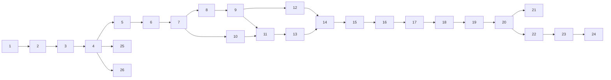

# 実装チケット

このディレクトリは、実装計画を新しいセッションで `チケット 1 を対応して` と指定できる小さな作業単位へ分けたものです。ローカルチケット ID は永続的な計画番号であり、GitHub Issue 番号とは無関係です。GitHub Issue を作成・対応付けしても、ここでの ID を変更しません。

計画書は背景と全体の設計、各チケットはその作業で必要な契約・検証・証跡を持ちます。作業者は対象チケット、[開発ワークフロー](../development-workflow.md)、実装時の `.agents/skills/implement-ticket/SKILL.md` を読み、必要になった場合だけ実装計画の参照節へ戻ります。

## 状態と依存関係

この一覧や個別チケットは予定であり、完了状態を表しません。状態は `docs/tickets/reports/NNN.md` の報告と main へ merge された PR から導出します。依存チケットを受け入れる条件は、対応する report が `Status: verified` を示し、その PR が `origin/main` に merge 済みで、すべての MUST 受け入れ基準が満たされていることです。index の `depends_on` はこの条件を適用する DAG の辺です。

各作業ブランチは `feat/ticket-NNN-slug`、報告は `reports/NNN.md` を使います。報告は実装 PR 内で追加し、自動検証コマンドと結果、レビューした実装コミット、未解決事項を記録します。PR の最終 head SHA と CI URL は PR 本文に記載します。将来の merge commit を事前に書く必要はありません。人の Windows/音声確認は自動検証とは別欄です。個別チケットで **必須** と明示しない限り、未実施の聴感確認は ticket の verified 判定や後続作業を止めません。コンテナやheadless E2Eは、聴感、音切れ、可聴遅延の合格証明にはなりません。

## チケット一覧

| ID  | マイルストーン | 件名                                                                | 依存           | 並行レーン |
| --- | -------------- | ------------------------------------------------------------------- | -------------- | ---------- |
| 1   | M1             | [Web 基盤](001-web-foundation.md)                                   | —              | A          |
| 2   | M1             | [Worklet build contract](002-worklet-build-contract.md)             | 1              | A          |
| 3   | M1             | [開始/停止の縦切り](003-audio-start-stop-slice.md)                  | 1, 2           | A          |
| 4   | M1             | [テストとCI](004-test-and-ci-baseline.md)                           | 1, 2, 3        | A          |
| 5   | M2             | [config と単気筒 preset](005-engine-config-and-single-preset.md)    | 1, 4           | B          |
| 6   | M2             | [回転モデル](006-rotational-dynamics.md)                            | 5              | B          |
| 7   | M2             | [位相と燃焼 event](007-phase-and-firing-events.md)                  | 5, 6           | B          |
| 8   | M2             | [pulse と保護](008-single-cylinder-pulse-and-protection.md)         | 6, 7           | B          |
| 9   | M2             | [単気筒統合](009-single-cylinder-worklet-integration.md)            | 3, 5, 6, 7, 8  | B          |
| 10  | M3             | [多気筒 preset](010-multicylinder-config-and-presets.md)            | 5, 7           | C          |
| 11  | M3             | [安全な位相 editor](011-config-editor-safe-apply.md)                | 3, 5, 9, 10    | C          |
| 12  | M3             | [アクセルと負荷](012-throttle-and-load-controls.md)                 | 6, 9           | D          |
| 13  | M3             | [波形とFFT](013-waveform-and-spectrum.md)                           | 9, 10, 11      | C          |
| 14  | M3             | [M3回帰/受け入れ](014-m3-regression-and-usable-demo.md)             | 10, 11, 12, 13 | C+D        |
| 15  | M4             | [吸排気共鳴](015-intake-exhaust-resonators.md)                      | 8, 14          | E          |
| 16  | M4             | [機械音/ばらつき](016-mechanical-noise-and-seeded-variation.md)     | 8, 15          | E          |
| 17  | M4             | [aliasing/bank土台](017-aliasing-and-bank-path-foundation.md)       | 10, 15, 16     | E          |
| 18  | M4             | [M4品質レビュー](018-m4-sound-quality-review.md)                    | 15, 16, 17     | E          |
| 19  | M5             | [a11y/lifecycle](019-accessibility-and-audio-lifecycle.md)          | 14, 18         | F          |
| 20  | M5             | [実ブラウザ/長時間](020-browser-and-long-run-validation.md)         | 14, 17, 19     | F          |
| 21  | M5             | [配信/hosting判断](021-production-delivery-and-hosting-decision.md) | 1, 20          | G          |
| 22  | M6             | [2ストローク](022-two-stroke-cycle-support.md)                      | 10, 20         | H          |
| 23  | M6             | [V型/自動車 preset](023-v-and-automotive-presets.md)                | 17, 20, 22     | H          |
| 24  | M6             | [drivetrain/gear](024-drivetrain-load-and-gear.md)                  | 6, 20, 23      | H          |
| 25  | M3             | [Oxlint移行](025-oxlint-migration.md)                               | 4              | I          |
| 26  | M1             | [Node 26 / TypeScript 7移行](026-node26-typescript7-toolchain.md)   | 4              | J          |

## DAG と並行レーン

推移的な依存辺を省略した図です。正確な依存先は `index.json` を原本とします。

レーンAは基盤を直列に確定する。M2以降は、依存が verified になった時点で C/D や、M4の関連作業を部分的に並行化できる。レーンIとJは機能DAGと独立した開発基盤更新である。Ticket 25は現在 blocked であり、Ticket 26は現行ESLint経路を前提にする。将来Ticket 25が verified になった場合だけそのlint経路を引き継ぐ。両チケットはlint依存を共有するため同時に実装しない。DAGにない共有ファイルを同時に編集する場合は、一方を小さな先行PRにする。
